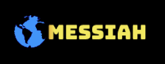

# Microsoft CodeFunDo++ 2018 (Team Sorcerers)


## Contributing

Since the project is open source everyone is welcome to contribute.

Please refer to CONTRIBUTING.md for more details.


## Implementation

### Deployment

The backend of the application is deployed at https://cfd-backend.herokuapp.com/<br/>
The frontend website is hosted on Heroku at https://messiah-cfd.herokuapp.com/


### Directory Structure

--> Repo <br/>
  * ---> logs <br/>
      * ---> backend.log <br/>
      * ---> frontend.log <br/>
  * ---> src <br/>
      * ---> config <br/>
          * ---> stores important configuration files
          * ---> loggerConfig.yaml
      * ---> frontend <br/>
          * ---> all the code using HTML, JS for frontend <br/>
          *  ---> _Dockerfile_ <br/>
          *  ---> _README.md explaining backend_ <br/>
      * ---> backend <br/>
          * ---> data <br/>
              *  ---> database files (if not being stored remotely)<br/>
          *  ---> python and flask backend<br/>
          *  ---> _Dockerfile_<br/>
          *  ---> _README.md explaining frontend_ <br/>
      * ---> _docker-compose file_<br/>
  * ---> docs<br/>
      * ---> _basic documentation for the entire project explaining_ <br/>
  * ---> other files<br/>

### Dev Instructions

While developing the project, we will be using Pipenv to manage dependencies.
The following instructions will help in setting your environment for the first time"

```bash
sudo pip install pipenv
cd /path/to/repo
pipenv shell --three
pipenv install --dev
```

Now you're in a virtual environment with all the required packages (even those for
marked as only for development). To start the virtual environment again,

```bash
cd /path/to/repo
pipenv shell
```

Install new packages only after activating the virtual environment to make sure it
gets added to the Pipfile automatically.

```bash
pipenv install [PACKAGE_NAME]
```

NOTE: Add `--dev` at the end if the package is required only while developing and not
using.

### Frontend GUI 

* --> A Landing page
  * --> Title of our project
  * --> Search Bar / Option to give us browser location
  * --> A revolving globe (just for show)
  * --> A Navbar having links to different services we are going to provide (as mentioned below)
* --> About Us
  * --> Simple mission, and introduction about team members.
* --> A unified dashboard (a single dynamic page) showing the below data:
    * --> Page having, map interface saying previous earthquake data, for set location.
    * --> Page, predicting the possibility of the natural disaster, judging the location of the user (optional)
    * --> Page having, map interface showing present location of the user (and plausible relief camp placements, and the shortest route to the closest one)
    * --> Page, which shows precautions and tips on the basis of location of the user
* --> _A static page, displaying the SMS functionality procedure, and set up._
* --> Scope for further improvements(whatever we couldn't do), github link to the repo, and vote of thanks.

## Idea Synopsis

### Who are we

We are a group of three sophomore students. The team members are as follows:

1. Anuprava Chatterjee ([@theartist007](https://github.com/theartist007))
2. Navaneeth Suresh ([@themousepotato](https://github.com/themousepotato))
3. Shivam Kumar Jha ([@thealphadollar](https://github.com/thealphadollar))

All three of us are from different regions and different backgrounds and have a diverse understanding of the conditions of calamities in our region. This would, I believe help us in fabricating a better solution.

### What are we planning to build

We are planning to build a service to help save lives and prevent economic losses through mechanisms to predict, prevent, or manage the impact of natural disasters, as accurately as possible and feasible using the dataset procurable.
The service would:

1. Predict (show probability) the possibility of a natural disaster, in any given location, set by the user.

2. Show the user / relief providers the most appropriate area to set the camp in.

3. Guide the user to all the relief points such as government schools, hospitals and police stations located within a specified radius and also provide a guided path to the nearest one of them.

4. Provide the user with valuable precautions which can be implemented well in advance based on the geography and topography of the location the user resides in. These tips will be such as "build houses with x type of pillars to ensure sturdiness at times of earthquake".

5. A person would also be able to list the danger he is in, and accordingly a response team can be assigned to him (or can volunteer to help him). A distress receiver and responder will be made available.

6. Relief centres can list the type of services they can provide and the area they can cover and accordingly people can request and post about their needs on the forum. At times of ongoing disasters, a critical dynamic page will list all of these for each geographical area separately.

7. Show data of previous natural disasters of the area, and grossly present the damage done by them to property and life.

### How does it work

Each bullet point has been explained with accordance to its order in the previous heading.

1. Using the global dataset available (which is, frankly, not up to the mark) we can form a pattern in the occurrence of global disasters and combining it with the susceptibility of a disaster according to geography, we can come up with the probability of various disasters occurring in near future.

2. Will be done by parsing an user's location (or manually taking it for relief centres) and then assessing the population density distribution of the area (in peace times) and also the impact of the disaster if any ongoing. Through testing multiple algorithms, a suitable weight will be chosen for the two.

3. In a similar manner as above, once an user's location is received we can show him the locations on a map and have a path set to the nearest station; both graphical and textual manner.

4. Dividing the area based on disaster data; such as earthquake-prone, flood-prone and then accordingly devising a set of precautions and instructions which can help lower the damage done to life, property and other assets.

5. A separate "specific" dashboard shall be created for users / relief providers to interact and list the items they need / provide and the list is curated in a database and will be used in sync to match the needy with the providers at the right places and quickly.

6. Same as above; just different dashboard for relief centres and multiple other options so they can mark what all they have, and if they are occupied at the moment in some relief operation.

7. This can be done easily using the available surveys and records, arranging them in a suitable JSON-like format so that template pages can be filled with them.

### How users can get started with the project

The project will be provided as a web application in order to pass the hurdle of platform limitation. A simple, elegant and intuitive user interface will be provided along with a simple "help" to get the users as well as relief providers get started with the platform. Since the application will be a webApp, in the future it'll be easier to create mobile apps for the same.

The user will get a map-view of the location he is in, up-to a certain radius, which will show locations of relief centers and the  directions to the nearest of them. They can also get personalised help options, and relief procedures based on their response in the forum. _There will be multiple dynamic dashboards for different features such as maps, past data, relief calls etc._

_An appealing feature of the website will be the implementation of the SMS (and telephonic, if time permits) endpoints. This will ensure that the people without internet can also gather information and send help calls to the website without having to go to the website. This will be done as any other automated SMS API endpoint works; a set of keywords to recognize the type of message and then providing all the services (for example providing textual directions to the nearest relief point) through SMS._

### What dataset(s) are we using

We are planning to build a web app based on the dataset of whole world (or anything close to it). We've been testing data from [gisresources](http://www.gisresources.com/natural-disasters/) or [emdat](https://www.emdat.be/) on various scenarios. Due to the vastness of the dataset, it is not viable to train the deep learning models on our systems, and hence Azure Cloud Resources will be utilized in the process of assessment of various datasets and gauging their accuracy.

We will be using multiple geographical data to decide the zones of disaster prone areas, and population density. We will also procure (or produce) data for predicting and providing precautions according to the division of zones. We have been looking at [Azure's Earth Science data from NASA](https://earthdata.nasa.gov/) and [Azure's US Government Data](https://www.census.gov/data.html) for viable datasets in aiding in our purpose.

Specifically for the part of prediction, we need to look at the pattern of natural disasters for the past decades and draw a pattern and then deduce the possibility and effects of a disaster in an area. The estimate of future damage will be based on past data and will be calculated using simple data analysis techniques.

### What technologies are we using

- Python 3.6.5 with Pipenv
- JavaScript
- HTML5 + CSS3
- GitHub for hosting
- [Microsoft Azure Data Science Virtual Machine](https://azure.microsoft.com/en-in/services/virtual-machines/data-science-virtual-machines/) for training prediction models
- Microsoft Azure Cloud for deployment
- _[Docker](https://www.docker.com/) to deploy as containers by handling microservices_
- [Flask](http://flask.pocoo.org/)
- [Elasticsearch](https://www.elastic.co/products/elasticsearch) as a distributed RESTful search engine
- _[Twilio SMS API](https://www.twilio.com/docs/sms)_
- Maps API (Opensource [LeafletJS](https://leafletjs.com/) with [OpenStreetMap](https://openstreetmap.org) as tile provider)
- Geocoding API (Opensource [Nominatim](https://nominatim.openstreetmap.org/) API to search from OpenStreetMap data)
- SQL Database as a service from [Azure](https://azure.microsoft.com/en-in/services/sql-database/).

### Final Notes

We will be trying to give equal resources and time to every field of the problem statement but our main object will be to create a system which can help at the times of disaster; and is even remotely accessible (_by SMS for instance_). A simple interactive platform between helpers and needy will go a long way in improving the scenario and dependency on various social media platforms. We also have the plan (a far-fetched one) of embedding a system in the platform where people can add family members and then at times of disaster mark themselves safe (or in danger) and our system will do the hard work of carrying their message to all.

We will be testing the technologies (mentioned above) and assessing if they need to be improved (or changed) to achieve the optimum efficiency for the goal.
